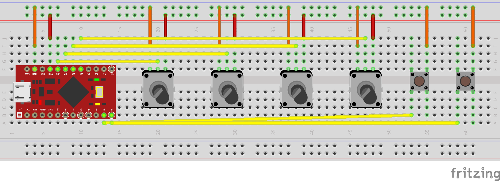

# midictrl Example

# Required Parts

* 4x 10k potentiometers.
* 2x push buttons.
* 1x Arduino compatible board based on ATmega32U4 or other microcontroller compatible with Pluggable USB library. We used SparkFun Pro Micro (https://www.sparkfun.com/products/12640)
* 1x breadboard, or soldering iron and some wires.

# Steps

First, install usbmidi library to your Arduino IDE, see [here](https://github.com/BlokasLabs/usbmidi) for instructions.

Then just connect all the parts as shown in the wiring diagram. If using a different Arduino board, make sure that potentiometers are connected to ADC pins and push buttons are connected to any digital pins, and you will have to adjust the analogPins and buttonPins in the sketch according to the connections you have actually made.

After flashing the sketch into the Arduino, it will be sending MIDI CC messages on controls 0-3 and Note On/Off messages for notes 64 and 65.
